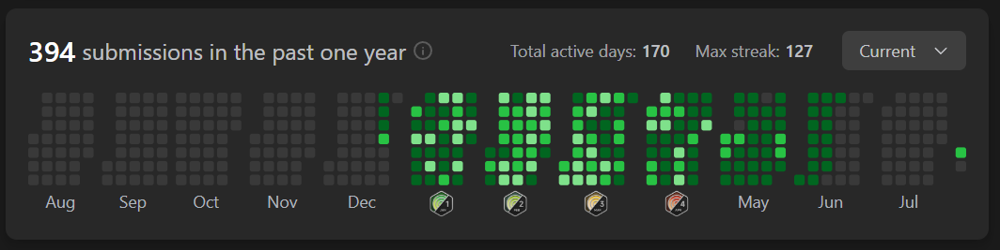

# LeetCode Study
`
- LeetCode 코딩 테스트 문제를 해결하고 저장하는 레포지토리
## 기존 문제점
***

- 풀이한 문제를 정리하지 않아 추후 복습시 찾아가는 것이 쉽지 않음
- 정리한 내용을 외부 불로그를 활용하는 등 관리할 매체가 늘어남에 따라 불편함이 생김

## 목표
***
- 기존 공부법에서 풀이한 문제들에 대한 정리가 되어있지 않은 부부을 해결하고자 함
- 문제 해결을 습관하 하기 위함
- 꾸준히 키우는 것을 목표로 함

## 공부 방식
***
- 1일 2문제씩 시간 제한을 설정하여 문제를 물이
- 문제 풀이 후 어려웠던 점이나 개선할 사항을 코멘트로 작성
- 50문제 단위로 3번 반복하여 3회독, 반복하면서 시간단축과 개선사항을 고민
- 3회독 후 50문제를 풀고 3회독 반복하는 방식

## 문제 풀이 현황 및 문제 코멘트
### 2024.08.02 ~

1회독(50문제)

 

| 문제	                                                          | 난이도  | 걸린시간 | 제한시간	 |     날짜     | 코멘트                                                                                        |
|:-------------------------------------------------------------|:----:|:----:|:-----:|:----------:|:-------------------------------------------------------------------------------------------|
| 1. Two Sum                                                   | easy |  11  |  25   | 2024/08/02 |                                                                                            |
| 21. PalindromeNumber                                         | easy |  19  |  25   | 2024/08/02 |                                                                                            |
| 14. Longest Common Prefix                                    | easy |  12  |  25   | 2024/08/03 |                                                                                            |
| 21. Merge Two Sorted Lists                                   | easy |  TO  |  25   | 2024/08/03 | 리스트 자료의 특성을 잘 생각해서 풀어보자                                                                    |
| 14. SqrtX                                                    | easy |  23  |  25   | 2024/08/04 | 이진 탐색을 너무 늦게 생각했다                                                                          |
| 190. Reverse Bits                                            | easy |  12  |  25   | 2024/08/04 | 비트 연산자를 빠르게 생각해 내서 쉽게 풀었음                                                                  |
| 441. Arranging Coins                                         | easy |  15  |  25   | 2024/08/05 | 수학적 접근                                                                                     |
| 530. MinimumAbsoluteDifferenceInBST                          | easy |  21  |  25   | 2024/08/05 |                                                                                            |
| 2053. Kth Distinct String in an Array                        | easy |  20  |  25   | 2024/08/06 | 문제 해석에서 시간 소요, 맵 자료구조 하나로 해결 가능해 보임                                                        |
| 2144. Minimum Cost Of Buying Candies With Discount           | easy |  11  |  25   | 2024/08/06 | 내림 차순 배열을 생각하다 3의 배수를 의미하는 변수를 추가함으로써 더 간결하게 구현하였음                                         |
| 1822. Sign of the Product of an Array                        | easy |  6   |  25   | 2024/08/07 | 초기에 자료형의 메모리를 고려하지 않고 설계하다가 오버플로우 발생                                                       |
| 2129. Capitalize the Title                                   | easy |  22  |  25   | 2024/08/07 | 마지막 공백(" ") 제거를 유의해야 한다                                                                    |
| 2716. Minimize String Length                                 | easy |  7   |  25   | 2024/08/08 |                                                                                            |
| 1827. Minimum Operations to Make the Array Increasing        | easy |  6   |  25   | 2024/08/08 |                                                                                            |
| 1518. Water Bottles                                          | easy |  8   |  25   | 2024/08/09 |                                                                                            |
| 559. Maximum Depth of N-ary Tree                             | easy |  15  |  25   | 2024/08/09 | 트리에서 문제해결 할 때 경게값에서 문제가 발생(뿌리, 잎)하는 것을 조심하자                                                |
| 674. Longest Continuous Increasing Subsequence               | easy |  20  |  25   | 2024/08/10 |                                                                                            |
| 680. Valid Palindrome II                                     | easy |  15  |  25   | 2024/08/10 | 회문 문제의 한 유형.                                                                               |
| 3079. Find the Sum of Encrypted Integers                     | easy |  22  |  25   | 2024/08/11 |                                                                                            |
| 2974. Minimum Number Game                                    | easy |  20  |  25   | 2024/08/11 |                                                                                            |
| 703. Kth Largest Element In a Stream                         | easy |  TO  |  25   | 2024/08/12 | nums가 비어있는 경우, k가 nums의 크기보다 작은 경우 등, 처리해야할 경우의 수가 많았다. 우선순위 queue자료 구조를 활용하면 더 쉽게 풀릴것 같다. |
| 1791. Find Center Of Star Graph                              | easy |  10  |  25   | 2024/08/12 |                                                                                            |
| 1967. Number of Strings That Appear as Substrings in Word    | easy |  6   |  25   | 2024/08/13 | 성능이 않좋게 나왔다. String에서 지원하는 메소드를 그대로 쓴 이유. 다음에는 다른 방식으로 풀 것                                 |
| 2180. Count Integers With Even Digit Sum                     | easy |  17  |  25   | 2024/08/13 |                                                                                            |
| 110. Balanced Binary Tree                                    | easy |  23  |  25   | 2024/08/14 |                                                                                            |
| 145. Binary Tree Postorder Traversal                         | easy |  17  |  25   | 2024/08/14 |                                                                                            |
| 860. Lemonade Change                                         | easy |  20  |  25   | 2024/08/15 |                                                                                            |
| 1636. Sort Array by Increasing Frequency                     | easy |  17  |  25   | 2024/08/15 |                                                                                            |
| 1784. Check if Binary String Has at Most One Segment of Ones | easy |  15  |  25   | 2024/08/16 |                                                                                            |
| 1903. Largest Odd Number in String                           | easy |  7   |  25   | 2024/08/16 |                                                                                            |
| 1437. Check If All 1's Are at Least Length K Places Away     | easy |  16  |  25   | 2024/08/17 | 분기문을 설정하는 사고력을 요구하는 문제였다.                                                                  |
| 1534. Count Good Triplets                                    | easy |  10  |  25   | 2024/08/17 |                                                                                            |
| 594. Longest Harmonious Subsequence                          | easy |  23  |  25   | 2024/08/18 | 조건 분기를 신경써야 할 게 많아서 다른 방법을 고민. Map자료구조를 사용하면서 편하게 해결                                       |
| 509. Fibonacci Number                                        | easy |  10  |  25   | 2024/08/18 |                                                                                            |
| 3194. Minimum Average of Smallest and Largest Elements       | easy |  5   |  25   | 2024/08/19 |                                                                                            |
| 2810. Faulty Keyboard                                        | easy |  12  |  25   | 2024/08/19 | Stringbuilder 내용을 공부                                                                       |
| 2264. Largest 3-Same-Digit Number in String                  | easy |  5   |  25   | 2024/08/20 |                                                                                            |
| 2335. Minimum Amount of Time to Fill Cups                    | easy |  22  |  25   | 2024/08/20 | 조건 분기를 생각하는데 시간이 걸림                                                                        |
| 2255. Count Prefixes of a Given String                       | easy |  15  |  25   | 2024/08/21 | String 객체의 startsWith()메소드를 응용함                                                            |
| 2437. Number of Valid Clock Times                            | easy |  10  |  25   | 2024/08/21 |                                                                                            |
| 476. Number Complement                                       | easy |  20  |  25   | 2024/08/22 | 논리 연산자로 해결하려 했으나 수학적 기법으로 해결하는 것이 더 간편함을 중간에 깨달음                                           |
| 2582. Pass the Pillow                                        | easy |  8   |  25   | 2024/08/22 |                                                                                            |
| 1189. Maximum Number of Ballons                              | easy |  11  |  25   | 2024/08/23 |                                                                                            |
| 1480. Running Sum of 1d Array                                | easy |  3   |  25   | 2024/08/23 |                                                                                            |
| 2099. Find Subsequence of Length K With the Largest Sum      | easy |  TO  |  25   | 2024/08/24 | 기존배열을 무너뜨리지 않기 위한 조치로 우선순위큐 자료구조를 사용하는 것을 배웠음                                              |
| 1844. Replace All Digits with Characters                     | easy |  19  |  25   | 2024/08/24 |                                                                                            |
| 3136. Valid Word                                             | easy |  23  |  25   | 2024/08/25 |                                                                                            |
| 3142. Check if Grid Satisfies Conditions                     | easy |  12  |  25   | 2024/08/25 |                                                                                            |
| 590. N-ary Tree Postorder Traversal                          | easy |  19  |  25   | 2024/08/26 | 깊이 우선탐색을 활용                                                                                |
| 1046. Last Stone Weight                                      | easy |  12  |  25   | 2024/08/26 | 우선순위 큐 자료구조 사용. reverseOrder()를 사용하여 내림차순 정렬 하는 방식을 기억할 것.                                 |

2회독(50문제)

 

| 문제	                                                          | 난이도  | 걸린시간 | 제한시간	 |     날짜     | 코멘트                                                 |
|:-------------------------------------------------------------|:----:|:----:|:----:|:----------:|:----------------------------------------------------|
| 1. Two Sum                                                   | easy |  10  |  25  | 2024/08/27 |                                                     |
| 9. PalindromeNumber                                          | easy |  12  |  25  | 2024/08/27 |                                                     |
| 14. Longest Common Prefix                                    | easy |  15  |  25  | 2024/08/28 | 1회독 시 해결방법으로 동일하게 풀이해서 다른 방식으로 접근.                  |
| 21. Merge Two Sorted Lists                                   | easy |  22  |  25  | 2024/08/28 | 재귀방식으로 해결                                           |
| 14. SqrtX                                                    | easy |  15  |  25  | 2024/08/29 |                                                     |
| 190. Reverse Bits                                            | easy |  10  |  25  | 2024/08/29 |                                                     |
| 441. Arranging Coins                                         | easy |  5   |  25  | 2024/08/30 | 다른 풀이법은 불필요해 보임                                     |
| 530. MinimumAbsoluteDifferenceInBST                          | easy |  21  |  25  | 2024/08/30 | 직관성을 높이기 위해 메소드 분리를 하였음                             |
| 2053. Kth Distinct String in an Array                        | easy |  TO  |  25  | 2024/08/31 | 기존 코드에서 시간, 공간복잡도가 개선된 코드를 보고 작성                    |
| 2144. Minimum Cost Of Buying Candies With Discount           | easy |  10  |  25  | 2024/08/31 |                                                     |
| 1822. Sign of the Product of an Array                        | easy |  5   |  25  | 2024/09/01 |                                                     |
| 2129. Capitalize the Title                                   | easy |  17  |  25  | 2024/09/01 |                                                     |
| 2716. Minimize String Length                                 | easy |  5   |  25  | 2024/09/02 | set자료구조를 사용해야 할 것을 바로 인지함                           |
| 1827. Minimum Operations to Make the Array Increasing        | easy |  5   |  25  | 2024/09/02 |                                                     |
| 1518. Water Bottles                                          | easy |  6   |  25  | 2024/09/03 |                                                     |
| 559. Maximum Depth of N-ary Tree                             | easy |  13  |  25  | 2024/09/03 |                                                     |
| 674. Longest Continuous Increasing Subsequence               | easy |  5   |  25  | 2024/09/04 | 스택 자료구조를 활용, 가독성을 높임                                |
| 680. Valid Palindrome II                                     | easy |  22  |  25  | 2024/09/04 |                                                     |
| 3079. Find the Sum of Encrypted Integers                     | easy |  16  |  25  | 2024/09/05 | 코드 간편화 진행                                           |
| 2974. Minimum Number Game                                    | easy |  6   |  25  | 2024/09/05 |                                                     |
| 703. Kth Largest Element In a Stream                         | easy |  TO  |  25  | 2024/09/06 | 우선순위큐를 활용한 문제풀이로 해결                                 |
| 1791. Find Center Of Star Graph                              | easy |  3   |  25  | 2024/09/06 |                                                     |
| 1967. Number of Strings That Appear as Substrings in Word    | easy |  3   |  25  | 2024/09/07 |                                                     |
| 2180. Count Integers With Even Digit Sum                     | easy |  18  |  25  | 2024/09/07 | 검증을 진행하는 로직을 메소드로 분리해서 사용하였음                        |
| 110. Balanced Binary Tree                                    | easy |  12  |  25  | 2024/09/08 |                                                     |
| 145. Binary Tree Postorder Traversal                         | easy |  11  |  25  | 2024/09/08 |                                                     |
| 860. Lemonade Change                                         | easy |  22  |  25  | 2024/09/09 |                                                     |
| 1636. Sort Array by Increasing Frequency                     | easy |  17  |  25  | 2024/09/09 |                                                     |
| 1784. Check if Binary String Has at Most One Segment of Ones | easy |  22  |  25  | 2024/09/10 |                                                     |
| 1903. Largest Odd Number in String                           | easy |  10  |  25  | 2024/09/10 |                                                     |
| 1437. Check If All 1's Are at Least Length K Places Away     | easy |  -   |  25  | 2024/09/11 |                                                     |
| 1534. Count Good Triplets                                    | easy |  -   |  25  | 2024/09/11 |                                                     |
| 594. Longest Harmonious Subsequence                          | easy |  20  |  25  | 2024/09/12 |                                                     |
| 509. Fibonacci Number                                        | easy |  12  |  25  | 2024/09/12 |                                                     |
| 3194. Minimum Average of Smallest and Largest Elements       | easy |  12  |  25  | 2024/09/13 | 정렬과정을 제외한 풀이법으로 성능 개선                               |
| 2810. Faulty Keyboard                                        | easy |  10  |  25  | 2024/09/13 | StringBuilder관련 내용을 다시 찾아보았다. 안보고 풀 수 있게 숙지하는 것이 좋음 |
| 2264. Largest 3-Same-Digit Number in String                  | easy |  18  |  25  | 2024/09/14 |                                                     |
| 2335. Minimum Amount of Time to Fill Cups                    | easy |  12  |  25  | 2024/09/14 | 수학적 접근으로 코드 개선                                      |
| 2255. Count Prefixes of a Given String                       | easy |  TO  |  25  | 2024/09/15 | startWith() 메소드 동작을 직접 구현해 보았음                      |
| 2437. Number of Valid Clock Times                            | easy |  18  |  25  | 2024/09/15 |                                                     |
| 476. Number Complement                                       | easy |  10  |  25  | 2024/09/16 | Integer 내장함수 highestOneBit()를 활용                    |
| 2582. Pass the Pillow                                        | easy |  15  |  25  | 2024/09/16 |                                                     |
| 1189. Maximum Number of Ballons                              | easy |  14  |  25  | 2024/09/17 |                                                     |
| 1480. Running Sum of 1d Array                                | easy |  10  |  25  | 2024/09/17 |                                                     |
| 2099. Find Subsequence of Length K With the Largest Sum      | easy |  23  |  25  | 2024/09/18 |                                                     |
| 1844. Replace All Digits with Characters                     | easy |  20  |  25  | 2024/09/18 |                                                     |
| 3136. Valid Word                                             | easy |  15  |  25  | 2024/09/19 |                                                     |
| 3142. Check if Grid Satisfies Conditions                     | easy |  9   |  25  | 2024/09/19 |                                                     |
| 590. N-ary Tree Postorder Traversal                          | easy |  17  |  25  | 2024/09/20 |                                                     |
| 1046. Last Stone Weight                                      | easy |  15  |  25  | 2024/09/20 |                                                     |

3회독(50문제)

 

| 문제	                                                          | 난이도  | 걸린시간 | 제한시간	 |     날짜     | 코멘트                  |
|:-------------------------------------------------------------|:----:|:----:|:-----:|:----------:|:---------------------|
| 1. Two Sum                                                   | easy |  6   |  25   | 2024/09/21 |                      |
| 9. PalindromeNumber                                          | easy |  8   |  25   | 2024/09/21 |                      |
| 14. Longest Common Prefix                                    | easy |  12  |  25   | 2024/09/22 |                      |
| 21. Merge Two Sorted Lists                                   | easy |  10  |  25   | 2024/09/22 |                      |
| 69. SqrtX                                                    | easy |  3   |  25   | 2024/09/23 | 제공되는 프레임워크를 사용하자     |
| 190. Reverse Bits                                            | easy |  12  |  25   | 2024/09/23 |                      |
| 441. Arranging Coins                                         | easy |  15  |  25   | 2024/09/24 | 양끝을 한번에 처리하면서 속도를 향상 |
| 530. Minimum Absolute Difference in BST                      | easy |  22  |  25   | 2024/09/24 |                      |
| 2053. Kth Distinct String in an Array                        | easy |      |  25   |            |                      |
| 2144. Minimum Cost Of Buying Candies With Discount           | easy |      |  25   |            |                      |
| 1822. Sign of the Product of an Array                        | easy |      |  25   |            |                      |
| 2129. Capitalize the Title                                   | easy |      |  25   |            |                      |
| 2716. Minimize String Length                                 | easy |      |  25   |            |                      |
| 1827. Minimum Operations to Make the Array Increasing        | easy |      |  25   |            |                      |
| 1518. Water Bottles                                          | easy |      |  25   |            |                      |
| 559. Maximum Depth of N-ary Tree                             | easy |      |  25   |            |                      |
| 674. Longest Continuous Increasing Subsequence               | easy |      |  25   |            |                      |
| 680. Valid Palindrome II                                     | easy |      |  25   |            |                      |
| 3079. Find the Sum of Encrypted Integers                     | easy |      |  25   |            |                      |
| 2974. Minimum Number Game                                    | easy |      |  25   |            |                      |
| 703. Kth Largest Element In a Stream                         | easy |      |  25   |            |                      |
| 1791. Find Center Of Star Graph                              | easy |      |  25   |            |                      |
| 1967. Number of Strings That Appear as Substrings in Word    | easy |      |  25   |            |                      |
| 2180. Count Integers With Even Digit Sum                     | easy |      |  25   |            |                      |
| 110. Balanced Binary Tree                                    | easy |      |  25   |            |                      |
| 145. Binary Tree Postorder Traversal                         | easy |      |  25   |            |                      |
| 860. Lemonade Change                                         | easy |      |  25   |            |                      |
| 1636. Sort Array by Increasing Frequency                     | easy |      |  25   |            |                      |
| 1784. Check if Binary String Has at Most One Segment of Ones | easy |      |  25   |            |                      |
| 1903. Largest Odd Number in String                           | easy |      |  25   |            |                      |
| 1437. Check If All 1's Are at Least Length K Places Away     | easy |      |  25   |            |                      |
| 1534. Count Good Triplets                                    | easy |      |  25   |            |                      |
| 594. Longest Harmonious Subsequence                          | easy |      |  25   |            |                      |
| 509. Fibonacci Number                                        | easy |      |  25   |            |                      |
| 3194. Minimum Average of Smallest and Largest Elements       | easy |      |  25   |            |                      |
| 2810. Faulty Keyboard                                        | easy |      |  25   |            |                      |
| 2264. Largest 3-Same-Digit Number in String                  | easy |      |  25   |            |                      |
| 2335. Minimum Amount of Time to Fill Cups                    | easy |      |  25   |            |                      |
| 2255. Count Prefixes of a Given String                       | easy |      |  25   |            |                      |
| 2437. Number of Valid Clock Times                            | easy |      |  25   |            |                      |
| 476. Number Complement                                       | easy |      |  25   |            |                      |
| 2582. Pass the Pillow                                        | easy |      |  25   |            |                      |
| 1189. Maximum Number of Ballons                              | easy |      |  25   |            |                      |
| 1480. Running Sum of 1d Array                                | easy |      |  25   |            |                      |
| 2099. Find Subsequence of Length K With the Largest Sum      | easy |      |  25   |            |                      |
| 1844. Replace All Digits with Characters                     | easy |      |  25   |            |                      |
| 3136. Valid Word                                             | easy |      |  25   |            |                      |
| 3142. Check if Grid Satisfies Conditions                     | easy |      |  25   |            |                      |
| 590. N-ary Tree Postorder Traversal                          | easy |      |  25   |            |                      |
| 1046. Last Stone Weight                                      | easy |      |  25   |            |                      |

